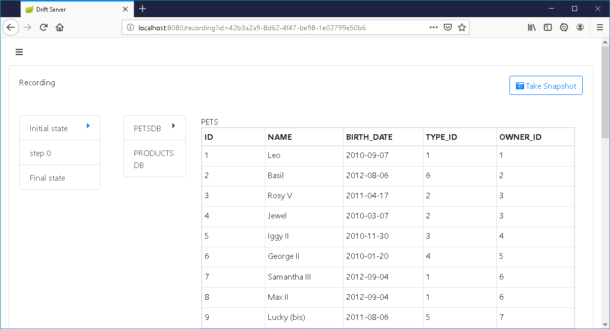
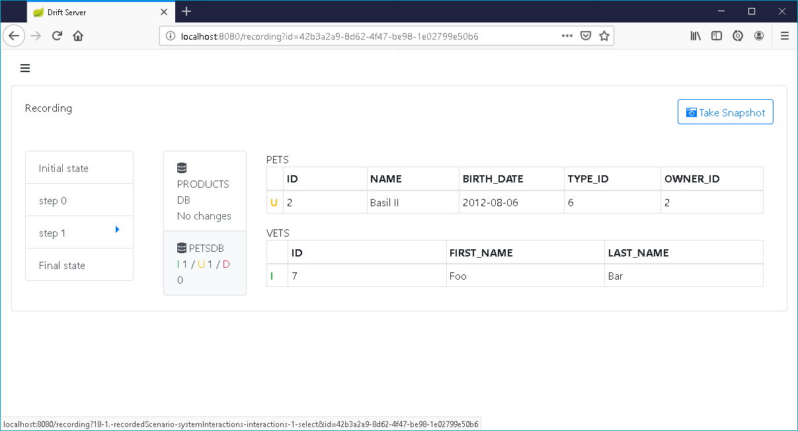

# What is Drift Server

Have you as a software developer ever been in the following situation: you start working on a legacy code base. You have no clue what the application is doing or how it is implemented. Documentation is lacking or not up to date.  

Drift Server is a tool to help you in this kind of situation.  It is used to quickly gain some insights when you start working on a complex existing legacy code base. You can treat the whole system as a black box, start with a local database with as little data as possible and see what happens in the DB every time you do something in the front-end.

Say you want to know what the system is doing when you create a new user: 

1. Connect Drift Server to the same databases \(or file systems\) as  your legacy application.  

2. Start a new recording from the recordings page

3.  Take an initial snapshot of the databases and filesystem as a baseline

4.  Change the state of the legacy system by interacting with it \(e.g. by executing the usecase "creating a new user"\) 

When done, take another snapshot, to compare with the first one to see what the application actually did:

Drift server is limited to a local development environment, with only a single user and with very low amount of data. It should work fine for about 10000 rows of data. 

