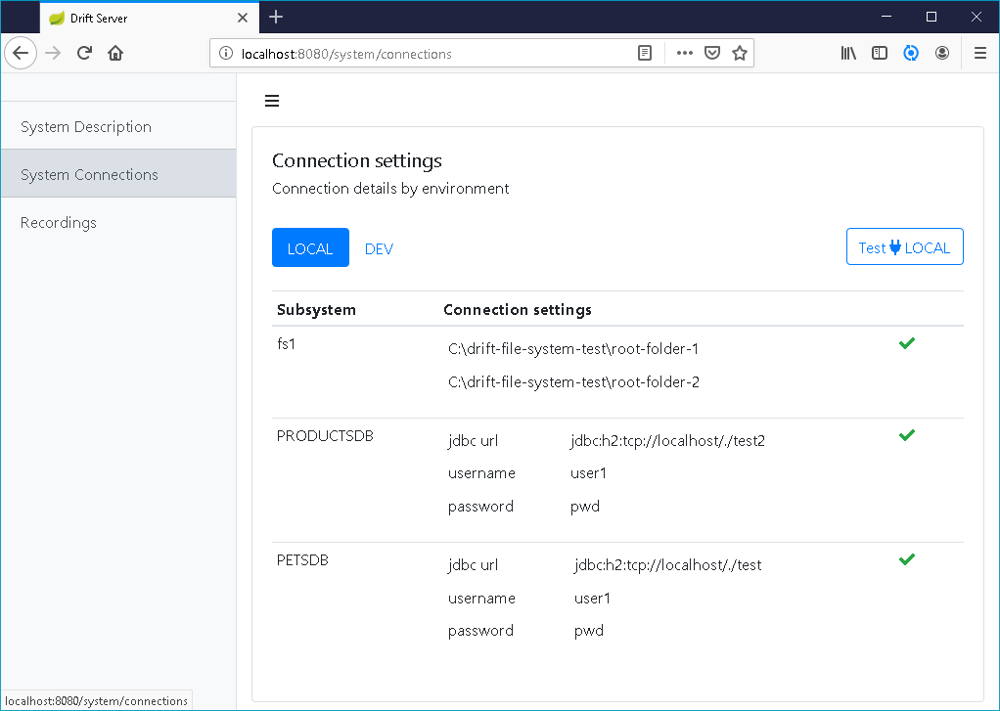
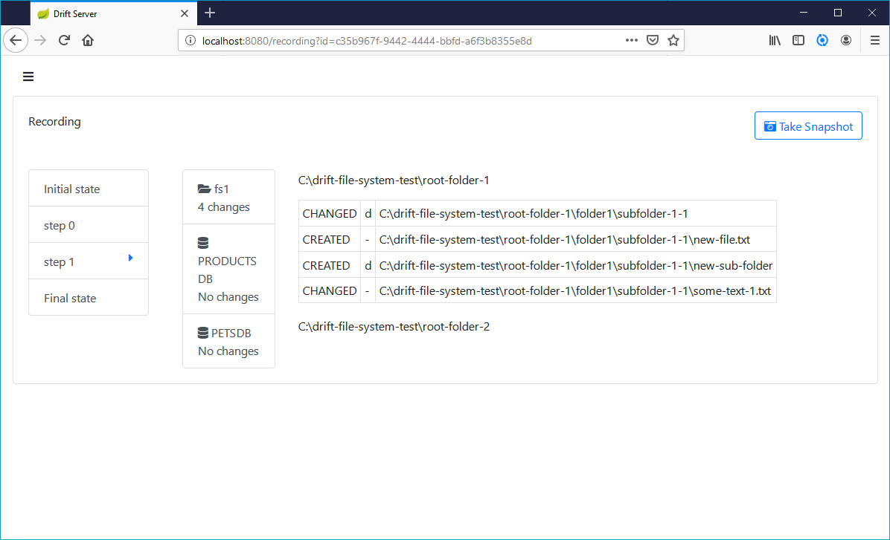

# What is Drift Server

Have you as a software developer ever been in the following situation: you start working on a legacy code base. You have no clue what the application is doing or how it is implemented. Documentation is lacking or not up to date.  

Drift Server is a tool to help you in this kind of situation.  It is used to quickly gain some insights when you start working on a complex existing legacy code base. You can treat the whole system as a black box, start with a local database with as little data as possible and see what happens in the DB every time you do something in the front-end.

Say e.g. you want to know what the system is doing when you create a new user. 

1. You connect Drift Server to the same databases \(or file systems\) as  your legacy application.  

2.  Take an initial snapshot of the databases and filesystem as a baseline

3.  Run the action on the legacy system \(e.g. create a user\) and then take antother snapshot, to compare with the first one to see what the application actually did

Drift server has a plugin architecture. For the moment Drift Server has plugins for SQL databases \(using  jdbc drivers\) and for file systems.  

The tool is limited to a local development environment, with only a single user and with very low amount of data. It should work fine for about 10000 rows of data. Typically a developer will install a system on his local machine or a docker container and then import some reference data and a trimmed down version of a production data dump.

