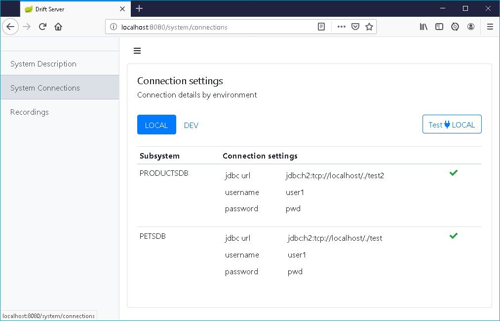
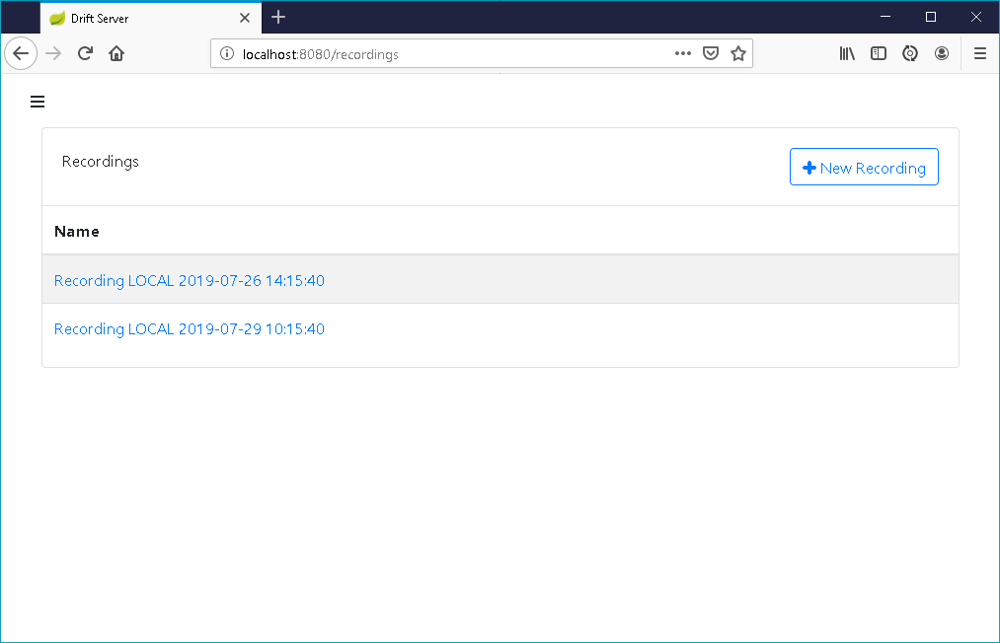

# Screenshots

## System Description Page

Overview of the high level system components and of the different environments where the system is deployed.

## System Connections Page

Provides an overview of the connection details for each subsystem grouped by environment. You can validate this connection settings by doing a connectivity test.

## Recordings Page

List metadata of recordings. Start a new recording or open an existing recording.

## Recording Page: initial state, final state

A recording starts with an **initial state**,  a full snapshot of all the system components.

 For jdbc components the full snapshot view consists of a dump of all the data in all the tables as specified in the config file. 

After some interacting with the system additional snapshots can be taken to see how the system state has changed. 

The **final state** is again presented as a full snapshot.

## Recording page: deltas between snapshots

 The intermediary states are presented as **deltas** between consecutive snapshots. 

For jdbc components a delta view consists of a **summary card** with the **number of inserts/updates/deletes**, and a detailed view of the changed table rows with a **row delta indicator**

| Indicator | Row |
| :--- | :--- |
| I | Inserted |
| U | Updated |
| D | Deleted |

