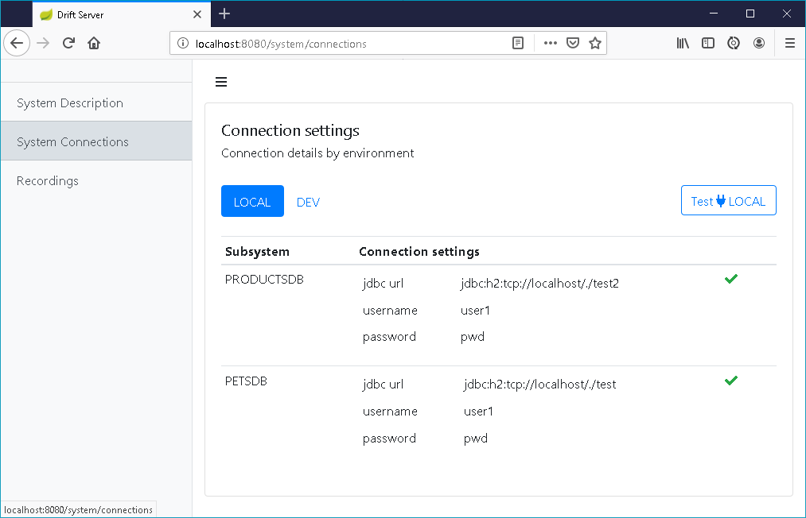
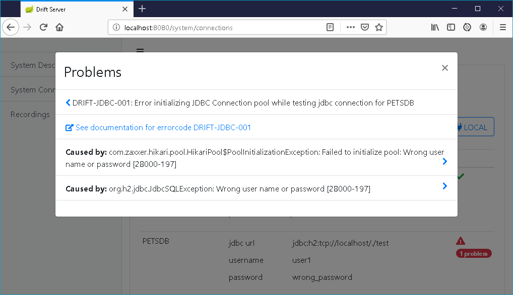

# JDBC Connections


### Add JDBC Driver 

Drift Server comes with the H2 database driver pre-installed. For other jdbc drivers  you need to **add the vendor specific jdbc driver to the lib directory**

### Add jdbc connection details to _systemdescription.yaml_

sample yaml snippet

```yaml
PRODUCTSDB::LOCAL: !<JDBCConnectionDetails>
  
    userName: user1
    password: pwd
    jdbcUrl: jdbc:h2:tcp://localhost/./test2

    tableNames:
    - CUSTOMER
    - PRODUCT
    - SUPPLIER
```


Do not forget to add

```yaml
!<JDBCConnectionDetails>
```

This is used by the jackson yaml parser to resolve the polymorphic type of the connection details. 


### Testing the connection settings

You can verify the connection settings in the "System Connections" page by clicking "Test" button.  





