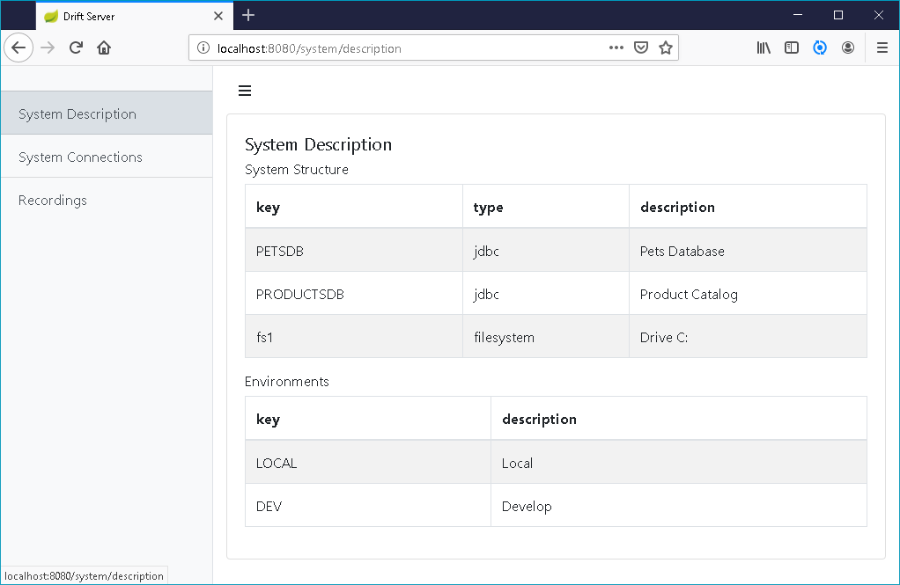
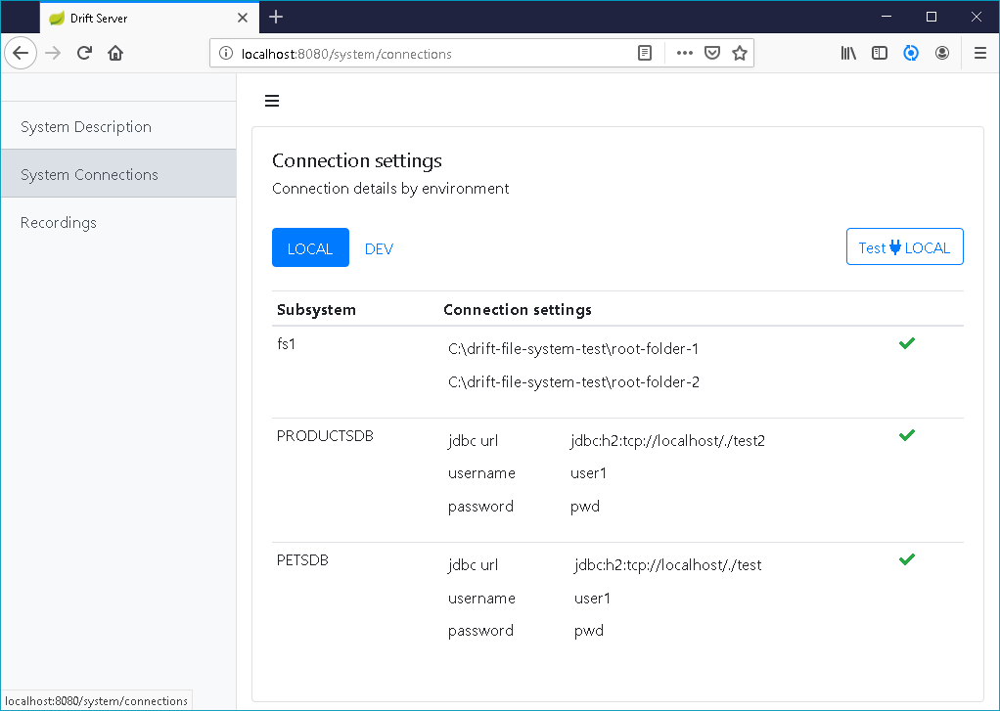
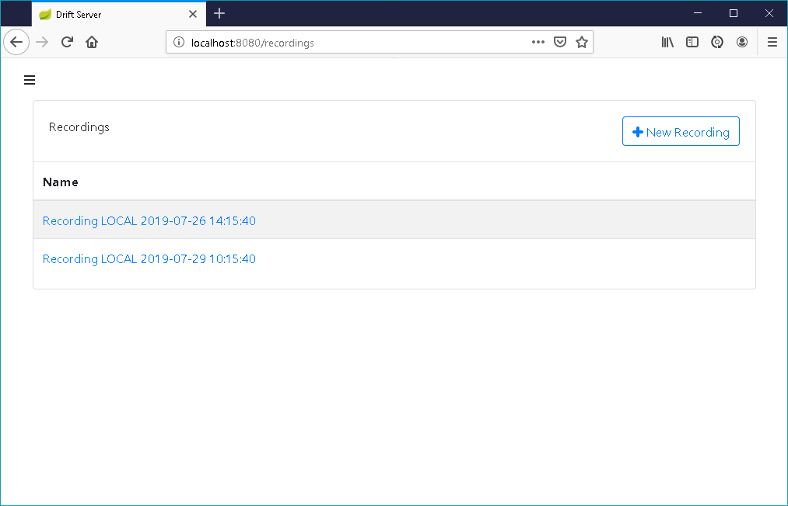
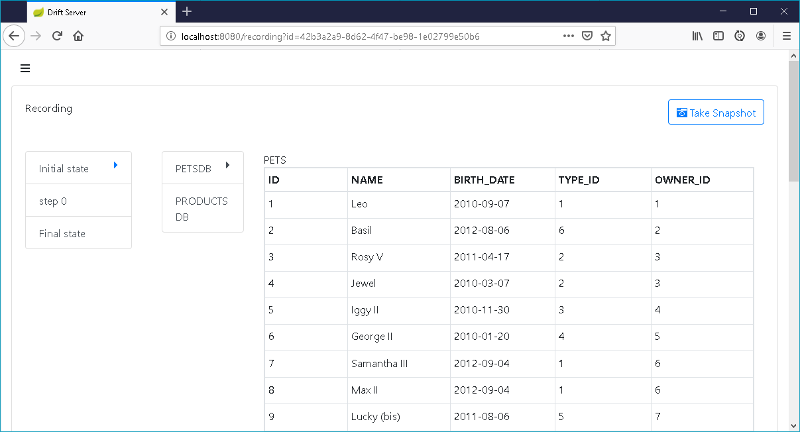
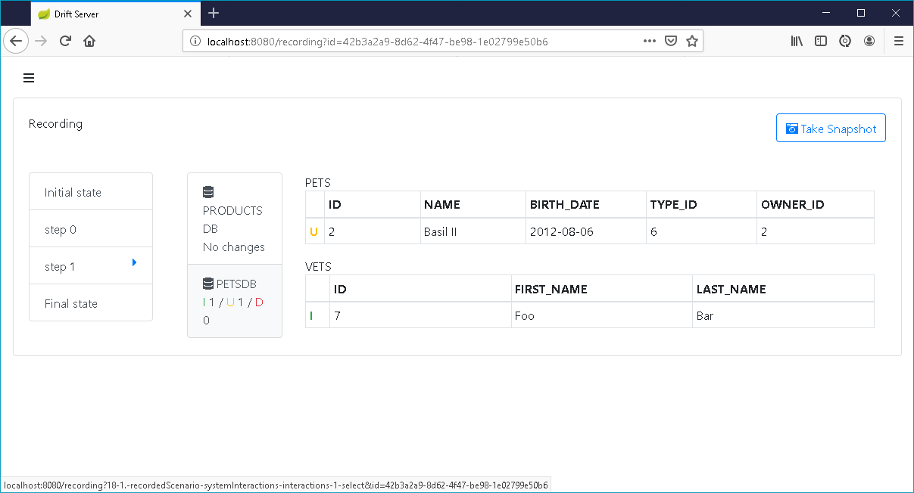
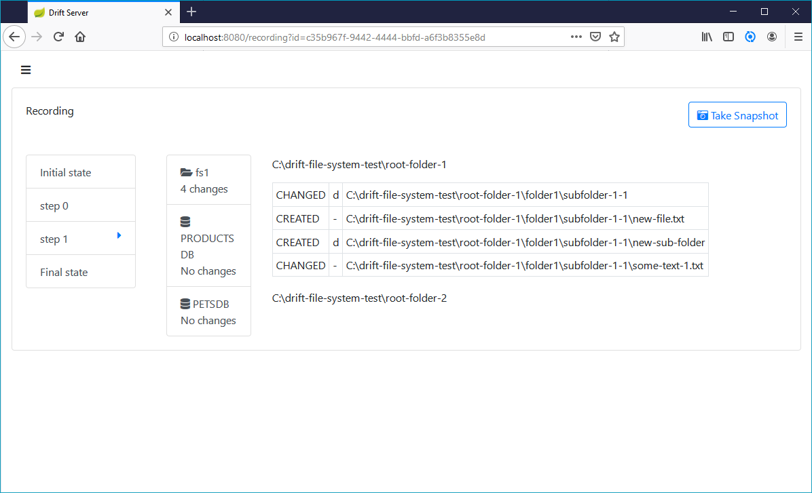

# Overview

## System Description Page

This page gives an overview of the high level system structure as configured in the config yaml file. The yaml file is reloaded every time the page is refreshed, so it is usefull to debug the yaml config file.

Every system component has a key, a type and a description. External database components have type jdbc.

 If the system is deployed in multiple environments, you can configure a list of different environments, each with a key and description.

## System Connections Page

This page gives an overview of the connection settings of each subsystem,  grouped in tabs by environment.  You can validate the connection settings for an environment by clicking the connectivity test button.

## Recordings Page

This page lists recordings and shows metadata of each recording like environment and creation date. From this page you can start a new recording or open an existing recording.

## Recording Page: initial state, final state

After clicking the "Take snapshot" button for the first time, the recording panel contains an **initial state**,  a full snapshot of all the system components.

 For jdbc components the full snapshot view consists of a dump of all the data in all the tables as specified in the yaml config file. 

After some interacting with the system additional snapshots can be taken to see how the system state has changed. 

Only the initial state and the **final state** are presented as a full snapshot. The intermediary snapshots are presented as **deltas**

## Recording page: deltas between snapshots

 The intermediary states \(i.e. initial nor final state\) are presented as **deltas** between consecutive snapshots. 

For jdbc components a delta view consists of a **summary card** with total number of inserts/updates/deletes , and a **detailed delta view** of the changed table rows with a **row delta indicator**

| Indicator | Row |
| :--- | :--- |
| I | Inserted |
| U | Updated |
| D | Deleted |

